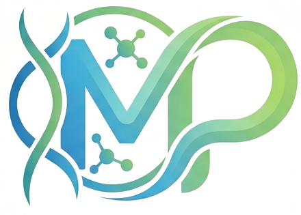
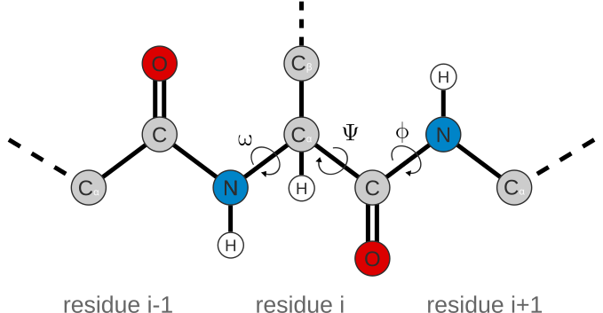

title: Hướng dẫn cấu trúc website
slug: huong-dan-cau-truc-website.html
tag: tag--tools
tag_label: Công cụ phân tích
date: 2026.09.10
reading_time: 20 phút đọc
author: Đào Huy Mạnh
excerpt: Ghi chú việc xây dựng một website cơ bản lấy website Mạnh Phượng — Ghi chép Y Sinh & Bioinformatics để minh họa.
---
# Hướng dẫn cấu trúc website cơ bản

## 1. Tổng quan

Website **Mạnh Phượng — Ghi chép Y Sinh & Bioinformatics** hiện được xây dựng chủ yếu từ hai file:

- `index.html`: nội dung, cấu trúc trang chủ và JavaScript.
- `style.css`: giao diện, bố cục, màu sắc, typography và responsive.

Có thể hình dung:

```text
index.html
    │
    ├── Nội dung + cấu trúc HTML
    └── JavaScript
          │
          ▼
      style.css
          │
          └── Quyết định cách website được hiển thị
```

Trong `index.html`, CSS được gọi bằng:

```html
<link rel="stylesheet" href="style.css">
```

---

## 2. Kiến trúc tổng thể của `index.html`

```text
index.html
│
├── <head>
│   ├── charset
│   ├── viewport
│   ├── title
│   ├── description
│   ├── author
│   ├── Google Fonts
│   └── style.css
│
├── <body>
│
├── HEADER
│   ├── Logo
│   ├── Navigation
│   └── Mobile menu button
│
├── HERO
│   ├── Tiêu đề
│   ├── Mô tả
│   ├── Buttons
│   └── SVG chromatogram
│
├── BÀI VIẾT
│   ├── Search
│   └── Post cards
│
├── CHỦ ĐỀ
│   └── Categories
│
├── GIỚI THIỆU
│   ├── Logo
│   ├── Mô tả
│   └── Links
│
├── NEWSLETTER
│
├── FOOTER
│
└── JAVASCRIPT
    ├── Mobile menu
    ├── Đếm bài theo topic
    ├── Filter topic
    └── Search
```

---

# 3. Phần `<head>` của `index.html`

## 3.1 HTML5 và ngôn ngữ

```html
<!DOCTYPE html>
<html lang="vi">
```

`<!DOCTYPE html>` khai báo tài liệu HTML5.

`lang="vi"` cho trình duyệt và công cụ hỗ trợ biết ngôn ngữ chính của trang là tiếng Việt.

Điều này có lợi cho:

- SEO
- accessibility
- screen reader
- trình duyệt
- công cụ tìm kiếm.

---

## 3.2 UTF-8

```html
<meta charset="UTF-8">
```

UTF-8 giúp website hiển thị đúng tiếng Việt, ví dụ:

```text
Mạnh Phượng
Sức khoẻ cộng đồng
Miễn dịch học
Sinh học phân tử
```

---

## 3.3 Responsive viewport

```html
<meta
  name="viewport"
  content="width=device-width, initial-scale=1.0"
>
```

Thiết lập chiều rộng website theo chiều rộng màn hình thiết bị.

Đây là thành phần quan trọng để website hoạt động tốt trên:

- Desktop
- Laptop
- Tablet
- Smartphone.

---

# 4. SEO cơ bản

Website có:

```html
<title>
  Mạnh Phượng — Ghi chép Y Sinh & Bioinformatics
</title>
```

`<title>` thường xuất hiện ở:

- tab trình duyệt
- bookmark
- kết quả tìm kiếm.

Website cũng có:

```html
<meta
  name="description"
  content="Mạnh Phượng — không gian chia sẻ kiến thức về Y Sinh, Bioinformatics, Genomics và Data Science."
>
```

Đây là meta description, giúp mô tả ngắn gọn nội dung website cho công cụ tìm kiếm.

Ngoài ra:

```html
<meta
  name="author"
  content="Đào Huy Mạnh và Nguyễn Thị Ngọc Phượng"
>
```

dùng để khai báo tác giả.

---

# 5. Google Fonts

Website sử dụng ba nhóm font:

```text
IBM Plex Serif
IBM Plex Sans
IBM Plex Mono
```

Trong CSS:

```css
--serif: "IBM Plex Serif", Georgia, serif;
--sans: "IBM Plex Sans", ...;
--mono: "IBM Plex Mono", ...;
```

Có thể hiểu:

| Font | Vai trò |
|---|---|
| IBM Plex Serif | Heading / tiêu đề |
| IBM Plex Sans | Nội dung thông thường |
| IBM Plex Mono | Navigation, metadata, thông tin kỹ thuật |

`IBM Plex Mono` đặc biệt phù hợp với website có chủ đề Bioinformatics và công nghệ.

---

# 6. Design Tokens trong `style.css`

Một phần rất quan trọng của `style.css` là:

```css
:root {
  --bg: #f3f5f4;
  --bg-panel: #e9ede9;
  --ink: #12232b;
  --ink-soft: #4b5d63;
  --ink-faint: #7c8b8f;
  --line: #d3dad6;
  --navy: #0e2233;
  --navy-soft: #16324a;
  --green: #2e9e6b;
  --green-deep: #227a54;
  --amber: #d98f2b;
  --coral: #cf5c48;
}
```

Đây là **CSS custom properties**, thường gọi là CSS variables.

Ví dụ:

```css
color: var(--ink);
```

sẽ lấy giá trị:

```css
color: #12232b;
```

### Lợi ích

Nếu muốn thay đổi màu chủ đạo của website, chỉ cần sửa biến ở `:root` thay vì phải tìm và sửa nhiều dòng CSS.

---

# 7. Ba hệ thống font trong CSS

```css
--serif: "IBM Plex Serif", Georgia, serif;
--sans: "IBM Plex Sans", system-ui, -apple-system, BlinkMacSystemFont, "Segoe UI", sans-serif;
--mono: "IBM Plex Mono", ui-monospace, SFMono-Regular, Menlo, Consolas, "Liberation Mono", monospace;
```

Có thể xem hệ thống typography như sau:

```text
SERIF
  ↓
Tiêu đề

SANS
  ↓
Nội dung

MONO
  ↓
Navigation / metadata / technical information
```

---

# 8. `.wrap` — giới hạn chiều rộng nội dung

CSS:

```css
.wrap {
  max-width: var(--max);
  margin: 0 auto;
  padding: 0 28px;
}
```

Trong đó:

```css
--max: 1120px;
```

Ý nghĩa:

- `max-width`: nội dung không vượt quá 1120 px.
- `margin: 0 auto`: căn giữa.
- `padding`: tạo khoảng trống hai bên.

Trên màn hình lớn:

```text
┌─────────────────────────────────────────────────────────┐
│                                                         │
│             [      1120px content      ]                │
│                                                         │
└─────────────────────────────────────────────────────────┘
```

Cách làm này giúp website không bị trải dài quá mức trên màn hình lớn.

---

# 9. `.track` — dấu nhận diện của website

Website có một thành phần gọi là genome-track divider:

```css
.track {
  height: 14px;
  background-image: repeating-linear-gradient(...);
}
```

Trong HTML:

```html
<div class="track"></div>
```

Nó tạo một đường ngang có cảm giác giống **genome coordinate track**.

Ví dụ:

```text
HEADER
────────┬────────┬────────┬────────
HERO
────────┬────────┬────────┬────────
ARTICLES
────────┬────────┬────────┬────────
TOPICS
```

Đây là một **visual motif** giúp website có bản sắc riêng và liên kết với chủ đề genomics.

---

# 10. Header

HTML:

```html
<header class="site-header">
```

Bên trong có `.wrap`, logo và navigation.

Logo:

```html
<a href="index.html" class="logo">
```

gồm:

```html

```

và:

```html
<span class="logo-name">
  Mạnh Phượng
</span>

<span class="logo-tagline">
  Biomedicine & Bioinformatics
</span>
```

---

# 11. Header sticky

CSS:

```css
.site-header {
  position: sticky;
  top: 0;
  z-index: 50;
}
```

Khi người dùng cuộn trang, header vẫn giữ vị trí ở phía trên.

`z-index: 50` giúp header nằm phía trên các thành phần khác.

Website còn dùng:

```css
background: rgba(243, 245, 244, 0.92);
backdrop-filter: blur(6px);
```

để tạo hiệu ứng nền hơi trong và mờ phía sau header.

---

# 12. Navigation và anchor links

Navigation chứa các link như:

```html
<a href="#bai-viet">Bài viết</a>
<a href="#chu-de">Chủ đề</a>
<a href="#gioi-thieu">Giới thiệu</a>
<a href="#lien-he">Liên hệ</a>
```

Ví dụ:

```html
<a href="#bai-viet">
```

sẽ đưa trình duyệt tới:

```html
<section id="bai-viet">
```

Đây gọi là **anchor navigation**.

---

# 13. Menu trên thiết bị di động

HTML có:

```html
<button
  class="nav-toggle"
  id="navToggle"
  aria-label="Mở menu"
  aria-expanded="false"
  aria-controls="primaryNav"
></button>
```

CSS mặc định:

```css
.nav-toggle {
  display: none;
}
```

Ở màn hình nhỏ:

```css
@media (max-width: 640px) {
  .nav-toggle {
    display: block;
  }
}
```

Vì vậy:

```text
Desktop
→ Navigation hiện trực tiếp

Mobile
→ Navigation ẩn
→ Button menu xuất hiện
```

---

# 14. Hero section

Hero là phần đầu tiên người dùng nhìn thấy.

Nó chứa:

- mô tả ngắn về website
- tiêu đề chính
- đoạn giới thiệu
- nút đọc bài
- nút giới thiệu
- hình SVG chromatogram.

Ví dụ nội dung:

```text
Ghi chép về Y Sinh & Sức khoẻ cộng đồng

Mạnh Phượng là nơi lưu lại...
```

---

# 15. Hero sử dụng CSS Grid

```css
.hero .wrap {
  display: grid;
  grid-template-columns: 1.1fr 0.9fr;
  gap: 56px;
}
```

Bố cục desktop có thể hình dung:

```text
┌──────────────────────┬──────────────────┐
│                      │                  │
│ Text                 │ Chromatogram     │
│                      │                  │
│                      │                  │
└──────────────────────┴──────────────────┘
       1.1fr                 0.9fr
```

Phần text rộng hơn hình minh họa.

---

# 16. `clamp()` cho tiêu đề

CSS sử dụng:

```css
font-size: clamp(34px, 4.2vw, 52px);
```

Điều này có nghĩa:

```text
Không nhỏ hơn 34px
        ↓
Co giãn theo kích thước màn hình
        ↓
Không lớn hơn 52px
```

Nhờ đó font tiêu đề thích ứng với nhiều kích thước màn hình mà không cần quá nhiều media query.

---

# 17. SVG chromatogram

Trong HTML có SVG:

```html
<svg
  class="chromatogram"
  viewBox="0 0 460 220"
  xmlns="http://www.w3.org/2000/svg"
>
```

Hình được tạo bằng các phần tử SVG như:

```html
<polyline ...>
<line ...>
<text ...>
```

Phần minh họa mô phỏng một **Sanger sequencing chromatogram** với các peak và ký tự nucleotide:

```text
A T G C A A T C G T A C
```

SVG có các ưu điểm:

- không cần file ảnh raster lớn
- sắc nét ở mọi độ phân giải
- có thể chỉnh bằng code
- phù hợp với website khoa học.

---

# 18. Phần Bài viết

HTML:

```html
<section id="bai-viet">
```

Phần này gồm:

```text
Search
+
Post cards
```

Ô tìm kiếm:

```html
<input
  type="search"
  id="siteSearch"
  class="search-input"
  placeholder="Tìm bài viết theo tiêu đề, nội dung, chủ đề..."
>
```

`id="siteSearch"` được JavaScript sử dụng để xử lý tìm kiếm.

---

# 19. Cấu trúc một post card

Mỗi bài viết có dạng:

```html
<a href="article.html" class="post-card">

  <div class="thumb">
    ...
  </div>

  <div class="body">

    <span class="tag tag--tools">
      Công cụ phân tích
    </span>

    <h3>
      Tiêu đề bài
    </h3>

    <p class="excerpt">
      Mô tả ngắn...
    </p>

    <div class="post-meta">
      ...
    </div>

  </div>

</a>
```

Có thể hình dung:

```text
┌─────────────────────────────┐
│          THUMBNAIL          │
├─────────────────────────────┤
│ CÔNG CỤ PHÂN TÍCH           │
│                             │
│ Tiêu đề bài viết            │
│                             │
│ Mô tả ngắn...               │
│                             │
│ 2026.09.04     10 phút đọc  │
└─────────────────────────────┘
```

---

# 20. Grid của các bài viết

CSS:

```css
.post-grid {
  display: grid;
  grid-template-columns: repeat(3, 1fr);
  gap: 28px;
}
```

Trên desktop:

```text
┌────────┐ ┌────────┐ ┌────────┐
│ Post 1 │ │ Post 2 │ │ Post 3 │
└────────┘ └────────┘ └────────┘

┌────────┐ ┌────────┐ ┌────────┐
│ Post 4 │ │ Post 5 │ │ Post 6 │
└────────┘ └────────┘ └────────┘
```

---

# 21. Featured grid

Website có biến thể:

```css
.post-grid.featured-grid {
  grid-template-columns: 1.3fr 1fr 1fr;
}
```

và:

```css
.post-grid.featured-grid > a:first-child {
  grid-row: span 2;
}
```

Do đó bài đầu tiên có thể nổi bật hơn:

```text
┌────────────────┐ ┌───────────┐
│                │ │ Post 2    │
│     Post 1     │ ├───────────┤
│    FEATURED    │ │ Post 3    │
│                │ └───────────┘
│                │
└────────────────┘
```

---

# 22. Thumbnail và SVG icons

Thumbnail sử dụng các file trong:

```text
assets/icons/
```

Ví dụ:

```html

```

CSS:

```css
.thumb-icon img {
  max-width: 100%;
  max-height: 100%;
  width: auto;
  height: auto;
  object-fit: contain;
}
```

Mục đích là giữ hình nằm gọn trong thumbnail và tránh bị méo hoặc tràn.

---

# 23. Hệ thống category/tag

Ví dụ:

```html
<span class="tag tag--tools">
  Công cụ phân tích
</span>
```

Các category được thể hiện bằng class như:

```text
tag--congdong
tag--tools
tag--miendich
tag--phantu
tag--thongtin
```

CSS có thể dùng các class này để tạo kiểu khác nhau.

Quan trọng hơn, JavaScript cũng sử dụng chúng để lọc bài viết.

Có thể hiểu:

```text
HTML
  ↓
tag--tools
  ↓
CSS → màu sắc / giao diện
  ↓
JavaScript → filter bài viết
```

---

# 24. Phần Chủ đề

HTML:

```html
<ul class="topic-list">
```

chứa các chủ đề như:

```text
Sức khoẻ cộng đồng
Công cụ phân tích
Miễn dịch học
Sinh học phân tử
Thông tin y sinh
```

Mỗi topic có:

```html
<li data-tag="tag--tools">
```

`data-tag` là một **data attribute**.

JavaScript có thể đọc nó bằng:

```javascript
li.dataset.tag
```

---

# 25. Tự động đếm số bài theo topic

HTML ban đầu có thể chứa:

```html
<span class="topic-count">
  0 bài
</span>
```

JavaScript tính số bài thực tế bằng:

```javascript
const count = document.querySelectorAll(
  ".post-card .tag." + tagClass
).length;
```

Ví dụ nếu có 7 bài thuộc `tag--tools`, giao diện sẽ hiển thị:

```text
7 bài
```

thay vì phải sửa thủ công.

---

# 26. Filter bài viết theo chủ đề

Khi click một topic, JavaScript lấy:

```javascript
const tagClass = li.dataset.tag;
```

sau đó gọi hàm lọc.

Với mỗi card:

```javascript
card.style.display =
  matches ? "" : "none";
```

Nếu bài phù hợp:

```text
display = ""
```

Nếu không:

```text
display = "none"
```

Do đó người dùng có thể lọc bài viết ngay trên trang mà không cần tải lại trang.

---

# 27. Search phía client

Website có hàm:

```javascript
function stripDiacritics(str) {
  return str
    .replace(/đ/g, "d")
    .replace(/Đ/g, "D")
    .normalize("NFD")
    .replace(/[\u0300-\u036f]/g, "");
}
```

Mục đích là chuẩn hóa tiếng Việt, giúp tìm kiếm ít phụ thuộc vào dấu.

Ví dụ:

```text
"sức khoẻ"
```

có thể được chuẩn hóa gần thành:

```text
"suc khoe"
```

Sau đó chuỗi được:

```javascript
.toLowerCase().trim();
```

để giảm khác biệt giữa chữ hoa và chữ thường.

---

# 28. Cách search hoạt động

JavaScript lấy toàn bộ nội dung của card:

```javascript
const haystack =
  normalizeText(card.textContent);
```

Sau đó kiểm tra:

```javascript
haystack.includes(query)
```

Nếu có từ khóa:

```javascript
card.style.display = "";
```

Nếu không:

```javascript
card.style.display = "none";
```

Đây là **client-side search**.

Không cần:

- database
- PHP
- Node.js
- API
- server riêng.

---

# 29. Responsive design

CSS có hai breakpoint chính:

```css
@media (max-width: 900px)
```

và:

```css
@media (max-width: 640px)
```

Có thể hiểu:

## Desktop

```text
3 cột bài viết
5 cột topic
2 cột hero
```

## Tablet

```text
2 cột bài viết
3 cột topic
1 cột hero
```

## Mobile

```text
1 cột bài viết
2 cột topic
1 cột hero
mobile navigation
```

Đây là cấu trúc responsive hợp lý cho blog cá nhân.

---

# 30. About section

Phần giới thiệu:

```html
<section class="about-section" id="gioi-thieu">
```

gồm:

- logo
- giới thiệu website
- thông tin tác giả
- liên kết
- thông tin license.

Nội dung giới thiệu xác định website là không gian chia sẻ kiến thức về:

```text
Y Sinh
Bioinformatics
Genomics
Data Science
```

---

# 31. Copyright và license

Website hiện phân biệt hai nhóm:

```text
CONTENT
↓
CC BY-NC 4.0

NAME / LOGO / BRAND
↓
không thuộc CC license
```

Điều này giúp phân biệt nội dung được cấp phép Creative Commons với tên thương hiệu và logo.

---

# 32. Newsletter

HTML có form:

```html
<form>
  <input type="email">
  <button type="submit">
    Đăng ký
  </button>
</form>
```

Tuy nhiên, nếu chỉ xét hai file hiện tại, form này mới là **giao diện**.

Để newsletter hoạt động thực tế cần có thêm cơ chế xử lý đăng ký, chẳng hạn một dịch vụ newsletter hoặc backend.

Không nên coi form HTML hiện tại là một hệ thống lưu email hoàn chỉnh.

---

# 33. Footer

Footer có dạng:

```html
<footer class="site-footer">
```

Nội dung gồm:

```text
© 2026 Mạnh Phượng
Ghi chép Y Sinh & Bioinformatics
```

và các liên kết như:

```text
Copyright & License
GitHub
ORCID
Email
```

CSS sử dụng màu navy làm nền để tạo sự tương phản với phần nội dung chính.

---

# 34. JavaScript và mobile menu

JavaScript lấy các phần tử:

```javascript
const navToggle =
  document.getElementById("navToggle");

const primaryNav =
  document.getElementById("primaryNav");
```

Khi click:

```javascript
primaryNav.classList.toggle("is-open");
```

Nếu chưa có `is-open`:

```text
→ thêm is-open
→ menu hiện
```

Nếu đang có `is-open`:

```text
→ xóa is-open
→ menu ẩn
```

CSS quyết định trạng thái hiển thị của `.is-open`.

---

# 35. Quan hệ giữa HTML, CSS và JavaScript

Đây là khái niệm quan trọng khi phát triển website.

Ví dụ Search:

### HTML

```html
<input id="siteSearch">
```

### JavaScript

```javascript
document.getElementById("siteSearch")
```

### CSS

```css
.search-input { ... }
```

Ba thành phần liên kết với nhau thông qua:

```text
id
class
data-attribute
```

---

## Ví dụ category

### HTML

```html
<li data-tag="tag--tools">
```

### CSS

```css
.tag--tools {
  ...
}
```

### JavaScript

```javascript
li.dataset.tag
```

và:

```javascript
card.querySelector(".tag." + tagClass)
```

Luồng hoạt động:

```text
data-tag
   ↓
JavaScript
   ↓
tìm tag tương ứng
   ↓
lọc post card
```

---

# 36. Một số bài viết vẫn là placeholder

Nếu một bài có:

```html
<a href="#" class="post-card">
```

thì bài đó chưa có trang riêng.

Khi hoàn thiện, nên đổi thành ví dụ:

```html
<a href="crispr-cas9.html" class="post-card">
```

`href="#"` thường chỉ có ý nghĩa placeholder hoặc đưa người dùng lên đầu trang.

---

# 37. "Xem tất cả bài viết"

Nếu link có:

```html
<a href="#" class="view-all">
  xem tất cả bài viết →
</a>
```

nhưng JavaScript chỉ gọi hàm bỏ filter, thì chức năng thực tế là:

```text
Hiện lại tất cả post card đang có trên index.html
```

chứ chưa phải:

```text
Mở một trang archive chứa toàn bộ bài viết
```

Nếu website sau này có nhiều bài, nên tạo một trang riêng như:

```text
archive.html
```

hoặc:

```text
bai-viet.html
```

---

# 38. `style.css` còn hỗ trợ trang bài viết

Cuối `style.css` có các selector như:

```css
.article-header
.article-meta
.article-author
.article-license
article.post-body
article.post-body p
article.post-body h2
article.post-body h3
article.post-body ul
article.post-body ol
article.post-body blockquote
article.post-body pre
article.post-body code
article.post-body table
article.post-body figure
article.post-body figcaption
```

Điều này cho thấy `style.css` không chỉ dành cho `index.html`.

Nó còn được thiết kế để dùng chung cho các trang bài viết.

Ví dụ:

```text
index.html
      │
      └── style.css
             │
             ├── Homepage styles
             └── Article styles
```

Đây là một cách tổ chức tốt vì tránh phải tạo một stylesheet riêng cho từng bài.

---

# 39. Website phù hợp với workflow Markdown

Cấu trúc hiện tại phù hợp để phát triển workflow:

```text
Markdown
   │
   ▼
Python script
   │
   ├── tạo HTML article
   ├── áp dụng article CSS
   └── cập nhật index.html
              │
              ▼
          Website
```

Ví dụ:

```text
article.md
    ↓
article.html
    ↓
post card
    ↓
index.html
```

`style.css` đóng vai trò lớp giao diện dùng chung.

---

# 40. Đánh giá cấu trúc hiện tại

## Điểm mạnh

### 1. Tách HTML và CSS

```text
index.html
style.css
```

rõ ràng và dễ bảo trì.

### 2. Có design tokens

```text
--bg
--ink
--green
--navy
--serif
--sans
--mono
```

giúp thay đổi giao diện nhanh.

### 3. Responsive

Có breakpoint cho tablet và mobile.

### 4. Có accessibility cơ bản

Ví dụ:

```html
aria-label
aria-expanded
aria-controls
```

và CSS:

```css
:focus-visible
```

### 5. Không phụ thuộc framework

Website không cần Bootstrap, React, Vue hoặc Tailwind.

Điều này giúp website nhẹ và phù hợp với GitHub Pages.

### 6. CSS dùng chung cho article

Đây là nền tảng tốt cho một blog tĩnh phát triển bằng Markdown.

---

# 41. Năm điểm nên cải thiện

## 41.1. Tách JavaScript khỏi `index.html`

Hiện JavaScript nằm trực tiếp cuối HTML:

```html
<script>
  ...
</script>
```

Khi website lớn hơn, nên chuyển thành:

```text
assets/
├── css/
│   └── style.css
└── js/
    └── main.js
```

và trong HTML:

```html
<script src="assets/js/main.js"></script>
```

---

## 41.2. Tách dữ liệu bài viết

Hiện tại từng post card được viết trực tiếp trong HTML.

Nếu có 100 bài, `index.html` sẽ rất dài.

Nên hướng tới:

```text
posts/
├── article1.md
├── article2.md
├── article3.md
└── ...
```

Sau đó dùng Python để tạo HTML.

---

## 41.3. Dùng metadata thống nhất

Mỗi bài Markdown có thể dùng front matter:

```yaml
---
title: "Tên bài viết"
date: "2026-09-06"
category: "tools"
author: "Đào Huy Mạnh"
description: "Mô tả ngắn"
icon: "assets/icons/example.svg"
---
```

Python có thể tự chuyển metadata thành:

```html
<span class="tag tag--tools">Công cụ phân tích</span>
```

---

## 41.4. Newsletter cần hệ thống xử lý thực tế

Form HTML hiện tại chỉ cung cấp giao diện.

Nếu muốn lưu email và gửi newsletter thực tế, cần tích hợp một dịch vụ newsletter hoặc backend.

---

## 41.5. Giảm trách nhiệm của `index.html`

Hiện `index.html` chứa:

```text
HTML
+
content
+
navigation
+
post data
+
JavaScript
```

Khi website phát triển, nên hướng tới:

```text
index.html
style.css
main.js
posts/
scripts/
assets/
```

---

# 42. Kiến trúc đề xuất cho website lâu dài

Một cấu trúc có thể phát triển tốt:

```text
daohuymanh.github.io/
│
├── index.html
├── copyright.html
│
├── assets/
│   ├── logo-icon.png
│   ├── icons/
│   ├── css/
│   │   └── style.css
│   └── js/
│       └── main.js
│
├── posts/
│   ├── nipah-review.md
│   ├── whisperx.md
│   ├── pandoc.md
│   └── ...
│
├── articles/
│   ├── nipah-review.html
│   ├── whisperx.html
│   └── ...
│
└── scripts/
    └── new_post.py
```

---

# 43. Workflow phát triển đề xuất

```text
Bạn viết
article.md
     │
     ▼
new_post.py
     │
     ├──────────────┐
     ▼              ▼
article.html     index.html
     │              │
     └──────┬───────┘
            ▼
       style.css
            │
            ▼
       GitHub Pages
```

Mục tiêu là:

> Viết bài một lần trong Markdown, sau đó tự động tạo trang bài viết và cập nhật danh sách bài viết.

Khi đạt được workflow này, không cần chỉnh sửa thủ công từng post card trong `index.html`.

---

# 44. Tóm tắt nhanh

Hai file hiện tại có vai trò:

```text
                  WEBSITE
                     │
         ┌───────────┴───────────┐
         │                       │
    index.html              style.css
         │                       │
         │                  giao diện
         │                  màu sắc
         │                  font
         │                  responsive
         │
         ├── Header
         ├── Hero
         ├── Posts
         ├── Topics
         ├── About
         ├── Newsletter
         ├── Footer
         │
         └── JavaScript
              ├── menu
              ├── search
              ├── filter
              └── count
```

Điểm quan trọng nhất:

- `index.html` hiện là **trang chủ + danh sách bài viết + bộ lọc/search phía client**.
- `style.css` là **hệ thống giao diện dùng chung**, bao gồm cả homepage và article pages.
- Hệ thống `class`, `id` và `data-*` là cầu nối giữa HTML, CSS và JavaScript.
- Cấu trúc hiện tại đã đủ tốt để chuyển sang workflow **Markdown → HTML → cập nhật index → GitHub Pages**.
- Bước phát triển tự nhiên tiếp theo là tách JavaScript, quản lý bài viết bằng Markdown/front matter và dùng Python để tự động build website.
